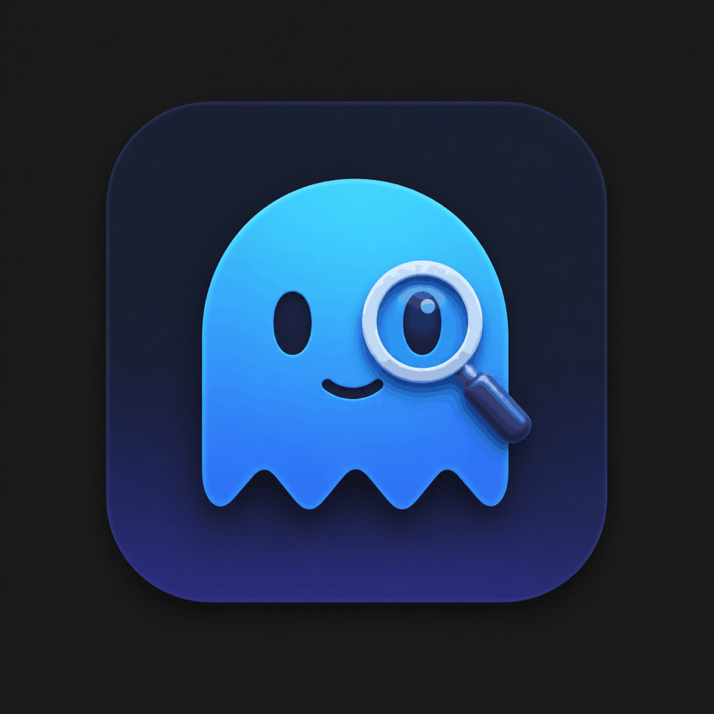

# team-7 Platanus Hack 26: Buenos Aires Project

**Current project logo:** project-logo.png



Track: 🛡️ AI Security

team-7

- Daniel Salmun ([@salmundani](https://github.com/salmundani))
- Franco Sánchez ([@francogabriel92](https://github.com/francogabriel92))
- Gianfranco Bogetti ([@bogettigian](https://github.com/bogettigian))

## What is wardlm?

wardlm is an OS-level security layer for AI coding agents on Linux. It intercepts every command an agent tries to run via a `seccomp` syscall listener and asks an LLM to classify it as safe or dangerous before the kernel lets it through.

Agent harnesses already have application-level guardrails. wardlm adds the missing OS-level defense.

## Features

- Kernel-level syscall filtering using `seccomp` (Linux 5.8+)
- LLM-powered command verdicts via the Anthropic Claude API
- Real-time desktop audit viewer (Electron)
- Per-agent shims for common tools (e.g. `claude-code`) and JSON-based policy config

## Install

```bash
curl -fsSL https://wardlm.vercel.app/install.sh | bash
```

## Usage

- Launch the audit viewer: `wardlm`
- Configure checks: `~/.config/wardlm/settings.json` (or use the Electron UI). Set your Anthropic API key in `~/.wardlm/env` or set it up in install instructions.

## Repo layout

- `wardlm/` — C core: seccomp listener, shims, Makefile build
- `wardlm-electron/` — Electron + React desktop audit viewer
- `wardlm-landing/` — Next.js landing site (hosts `install.sh`)

